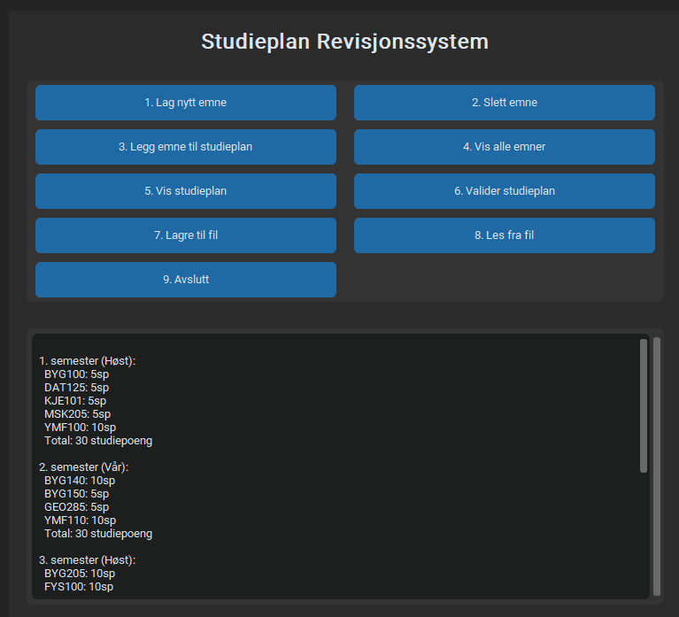
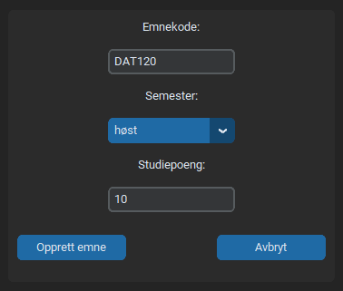
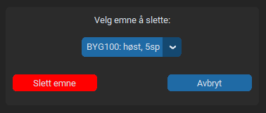
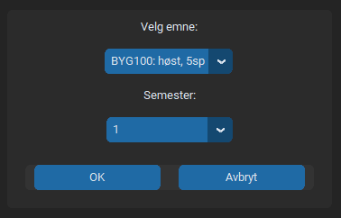

# Studieplan App

En enkel og modulær applikasjon for å administrere emner og studieplaner. Bygget med **Python** og **CustomTkinter**.

## Funksjoner
- Opprett og slett emner (kode, semester, studiepoeng).
- Legg emner inn i en studieplan (6 semestre).
- Validering av studieplan (30 studiepoeng pr. semester, riktige semestre).
- Lagre og lese data til/fra JSON.
- Moderne UI med **CustomTkinter**, støtte for mørk/lys-modus og skalering.

## Screenshots







## Installasjon

### Klon prosjektet
```bash
git clone https://github.com/Zaqoon/Studieplanlegger.git
cd Studieplanlegger
```

### Opprett virtuelt miljø (anbefalt)
```bash
python -m venv .venv
source .venv/bin/activate   # Mac/Linux
.venv\Scripts\activate      # Windows
```

### Installer avhengigheter
```bash
pip install -r requirements.txt
```

## Kjøring
Start applikasjonen med:

```bash
python main.py
```

## Prosjektstruktur
```
core/             # Logikk / validering
models/           # Pydantic modeller (Emne, Studieplan, etc.)
repositories/     # Lagring av data
services/         # Service for emner og studieplan
ui/               # CustomTkinter GUI
requirements.txt  # Avhengigheter
main.py           # Inngangspunkt
```

## Lisens
Se [LICENSE](LICENSE) for detaljer.
