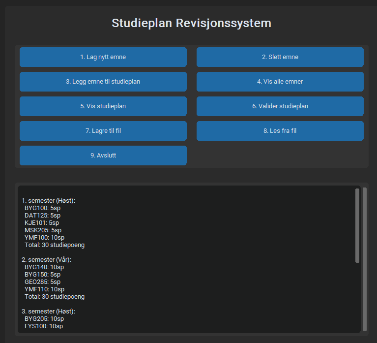
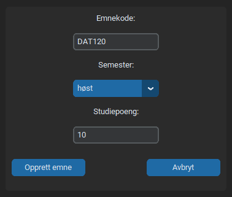
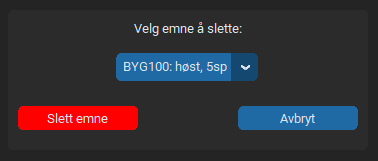
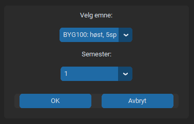

# Studieplan App

En enkel og modulær applikasjon for å administrere emner og studieplaner. Bygget med **Python** og **CustomTkinter**.

## Funksjoner

- Opprett og slett emner (kode, semester, studiepoeng).
- Legg emner inn i en studieplan (6 semestre).
- Validering av studieplan (30 studiepoeng pr. semester, riktige semestre).
- Lagre og lese data til/fra JSON med fil-dialoger.
- Moderne UI med **CustomTkinter**, støtte for mørk/lys-modus og skalering.

### Nye UI-knapper

1. Lag et nytt emne
2. Legg til et emne i en studieplan
3. Fjern et emne fra en studieplan
4. Skriv ut ei liste over alle registrerte emner
5. Lag en ny tom studieplan (tømmer all data i minnet)
6. Skriv ut en studieplan med hvilke emner som er i hvert semester
7. Sjekk om en studieplan er gyldig eller ikke
8. Finn hvilke studieplaner som bruker et oppgitt emne
9. Lagre emnene og studieplanene til fil
10. Les inn emnene og studieplanene fra fil
11. Avslutt

### Lagre/Lese

- Når du lagrer, åpnes en «Lagre som»-dialog som foreslår mappen `saved_plans/` og filtype `.json`.
- Når du leser, åpnes en «Åpne fil»-dialog som peker til `saved_plans/` og filtrerer på `.json`.
- Alle lagrede filer bør ligge i `saved_plans/`.

## Screenshots







## Installasjon

### Klon prosjektet

```bash
git clone https://github.com/Zaqoon/Studieplanlegger.git
cd Studieplanlegger
```

### Opprett virtuelt miljø (anbefalt)

```bash
python -m venv .venv
source .venv/bin/activate   # Mac/Linux
.venv\Scripts\activate      # Windows
```

### Installer avhengigheter

```bash
pip install -r requirements.txt
```

## Kjøring

Start applikasjonen med:

```bash
python main.py
```

## Prosjektstruktur

```text
core/             # Logikk / validering
models/           # Pydantic modeller (Emne, Studieplan, etc.)
repositories/     # Lagring av data
services/         # Service for emner og studieplan
ui/               # CustomTkinter GUI
saved_plans/      # JSON-filer lagret via UI
requirements.txt  # Avhengigheter
main.py           # Inngangspunkt
```

## Lisens

Se [LICENSE](LICENSE) for detaljer.
